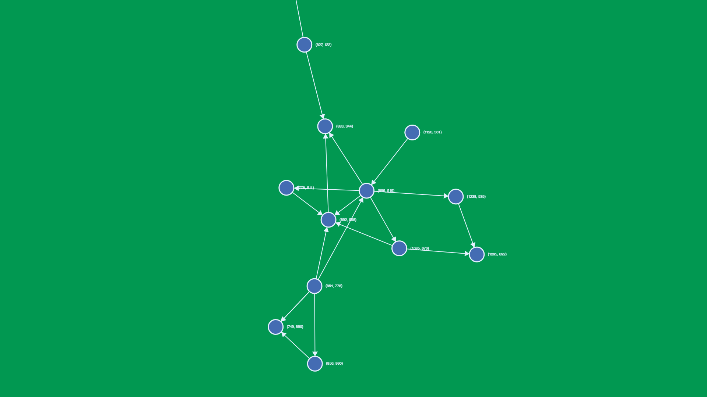

# Graphs

Tool for exploring and playing around with network graphs.

## Technologies

- HTML5 Canvas
- TypeScript
- Webpack

## Techniques

- Quadtrees and Barnes-Hut approximation (inspired by [D3.js](https://github.com/d3/d3-force#many-body))

---

## Roadmap

- [ ] Decide on format for storing networks
- [ ] Make canvas resize to size of viewport - maybe use requestAnimationFrame
- [ ] Optionally also 'zoom' in or out virtually depending on viewport size
- [x] Colour nodes and edges
- [ ] Allow user to create new nodes
- [ ] Allow user to create new edges between nodes (by clicking on node's edge and dragging to another one)
- [ ] Create import tool
- [ ] create connectors to interface with import tool - e.g. import friends list from FB or Twitter followers network
- [x] Create directed edges, with arrow to display direction
- [ ] Create dashboard
    - [ ] Allow user to save current state
    - [ ] Allow user to select from multiple saved states
    - [ ] Checkbox to display quadtrees
- [ ] Calculate tension of layout and reshuffle before render to get lowest-tensioned layout